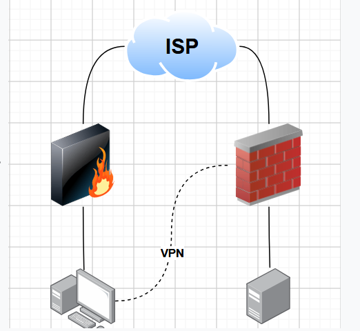
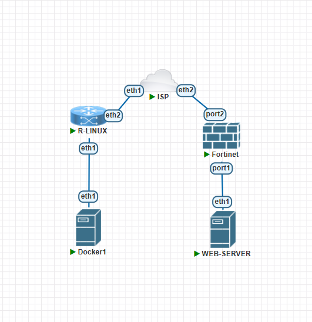

# Práctica VPN Site-to-Site — Infraestructura 3

**Videos de la práctica:** [Ver videos en OneDrive](https://1drv.ms/f/c/6b63aaec5c0ec7fc/IgDIK3ZKiVDHSqMyiQD1d0EqAV-zz2bVrkTrJduTAsyBIc8?e=ad0NjO)

## Objetivo

Permitir que el usuario visite el servidor web por HTTPS sin depender del túnel y que acceda por SSH a la dirección privada del servidor mediante la VPN site-to-site entre el peer Linux y el FortiGate. La configuración y demostración del FortiGate se realizan por su GUI.

## Topología





El montaje contiene USER-PC (Docker1), R-LINUX, ISP, Fortinet y WEB-SERVER. El enlace IPsec une R-LINUX con Fortinet a través del ISP.

## Direccionamiento observado

| Equipo / interfaz | Dirección | Uso |
| --- | --- | --- |
| USER-PC, `eth1.10` | `10.17.45.55/25` | Usuario de VLAN 10 |
| R-LINUX, `eth1.10` | `10.17.45.1/25` | Gateway de VLAN 10 y DHCP |
| R-LINUX, `eth2` | `198.51.100.2/24` | Interfaz hacia ISP |
| ISP | `198.51.100.1/24` | Red simulada del ISP |
| FortiGate, `port2` | `198.51.100.3/24` | Interfaz WAN / peer IPsec |
| FortiGate, `port1` | `10.17.45.129/28` | Gateway de la red del servidor |
| WEB-SERVER, `eth1` | `10.17.45.130/28` | HTTPS y SSH |

El FortiGate tiene el túnel `VPN-S2S` con peer `198.51.100.2` y una ruta estática a `10.17.45.0/25` por el túnel. Las direcciones `198.51.100.0/24` pertenecen al rango reservado para documentación y se usan aquí como IP públicas simuladas en el laboratorio.

## Acceso a la GUI del FortiGate

Desde USER-PC, la URL de administración comprobada es [http://198.51.100.3:8080](http://198.51.100.3:8080). El puerto administrativo HTTP está configurado en `8080`; la solicitud desde USER-PC respondió `HTTP 200`. El puerto HTTPS administrativo `8443` estaba configurado, pero la conexión se reinició en las pruebas. La URL HTTPS del servidor publicado es `https://198.51.100.3/` y respondió `HTTP 200 OK` de Apache.

## Pruebas y demostración

Ejecutar estos comandos en la terminal del USER-PC:

```bash
ifconfig eth1.10
route -n
traceroute -n -m 5 -q 1 -w 1 10.17.45.130
curl -k -I --connect-timeout 5 https://198.51.100.3/
ssh -o ConnectTimeout=5 admin@10.17.45.130
```

Resultados observados durante la revisión del 3 de octubre de 2026:

- USER-PC obtuvo `10.17.45.55/25` en `eth1.10`, con gateway `10.17.45.1`.
- El traceroute a `10.17.45.130` llegó por `10.17.45.1`, `10.17.45.129` y `10.17.45.130`.
- La GUI de FortiGate indicó `VPN-S2S` arriba, con el selector IPsec activo.
- HTTPS al IP público simulado `198.51.100.3` devolvió `HTTP 200 OK` de Apache.
- La conexión SSH alcanzó el servidor y llegó a la verificación de clave de host. Completar el inicio de sesión interactivo durante la grabación.

Para demostrar la independencia del acceso web y la dependencia de SSH respecto a la VPN, muestra primero el túnel arriba en la GUI; baja `VPN-S2S` por GUI, repite HTTPS y SSH, y luego vuelve a subirlo. La comprobación de HTTPS público se registró con el túnel arriba; graba también el resultado con el túnel abajo antes de presentar esa comparación como evidencia completa.

Al primer SSH, escribe `yes` para aceptar la huella del servidor y luego introduce las credenciales configuradas para la cuenta `admin`.

## Capturas

- [Diagrama objetivo](evidencias/capturas/01-diagrama-objetivo-infra3.png)
- [Topología PNETLab](evidencias/capturas/02-topologia-pnetlab-infra3.png)

Las capturas documentan el diseño y el montaje; las salidas descritas arriba se verificaron en el laboratorio, pero no se presentan como capturas de pantalla.